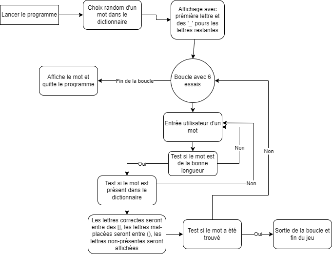

<h1 style="text-align: center; color:#337fd6;">SUTOM</h1>
<h2 style="text-align: center;">Groupe 2</h2>

Ce document est consultable [ici aussi.](https://demo.hedgedoc.org/wtS9f4D3SdGDLNn75ageHw?both)

    
| Type    | Cahier des charges                 |
|---------|------------------------------------|
| Nom     | Sutom                              |
| Auteurs | Edouard Crocq, Anparasan Anpukkody |
| Version | 1.0                                |
| Date    | 15/03/2024                         |

#### Composition du groupe 2 : 
- Edouard Crocq
- Anparasan Anpukkody

# I . Objectifs
## 1 . Description générale

### a . Contexte
Le projet de Sutom est créé pour le cours d'Outils informatiques collaboratifs.

### b . Besoin
Sutom est un jeu avec un seul joueur. Le programme doit choisir un mot entre 6 et 9 lettres et le joueur doit le trouver.

### c . Règles du jeu
Le joueur doit deviner un mot dont la longueur est comprise entre 6 et 9 lettres. La première lettre du mot à deviner est fournie par le jeu.
Il doit faire des propositions de mots, le jeu lui indiquant ensuite si telle ou telle lettre est bien présente dans le mot à deviner. Ses propositions de mots doivent être de la même longueur que le mot à trouver. Le mot proposé doit être présent dans le dictionnaire utilisé par le jeu.
Le joueur a seulement 6 essais.

## 2 . Interface utilisateur

### a . Visuel et interaction
Le jeu se jouera sur terminal. Le terminal affichera les lettres choisies par le joueur et marquera entre crochets les lettres bien présentes dans le mot à deviner et placées au bon endroit, entre parenthèses les lettres présentes dans le mot à un autre endroit.

    S _ _ _ _
    [S] A L (U) (T)
    [S] [U] [T] [O] [M]

### b .Manuel utilisateur
* Lancer le jeu : $python sutom.py
* Indiquer un mot au clavier, le valider avec la touche Entrée

### c . Contraintes techniques
- Le langage utilisée sera Python
- L'interface sera réalisé dans le terminal

### d . Scénario d'utilisation

# II. Analyse du besoin
## 1. Fonctionnalités
* Démarrer une partie
    * Afficher la première lettre du mot à trouver
* Jouer une manche
    * Saisir un mot au clavier
    * Vérifier la saisie du joueur
        * vérifier si la longueur du mot proposé
        * vérifier si la proposition est inclue dans le dictionnaire du jeu
    * Vérifier si les lettres sont inclus dans le mot à deviner
    * Vérifier la position des lettres
    * Afficher le résultat en fonction du choix du joueur et des deux vérification ci-dessus
* Finir la partie (soit par la victoire du joueur s'il a trouvé le mot ; soit par sa défaite s'il a utilisé son nombre d'essais maximum)

## 2 . Critères de validité et de qualité

### a . Validation
- Le code doit s'exécuter correctement en suivant les instructions livrées avec le logiciel.
- L'utilisation du logiciel permettra de constater que les fonctionnalités ont été bien été implémentées.

### b . Qualité
- L'interface devra être suffisamment ergonomique pour permettre au joueur d'enchaîner rapidement les manches et d'entrer rapidement les mots.

### c . Importance des fonctionnalités

    0 : Indispensable
    1 : Forte valeur ajoutée
    2 : Optionnelle

| Fonctionnalité | Importance |
| -------- | -------- |
| Afficher la 1ère lettre     | 1     |
| Saisie mot     | 0     |
| Vérifier longueur saisie     | 2     |
| Vérifier existence saisie     | 2     |
| Vérification lettres     | 0     |
| Vérification position lettres     | 0     |
| Affichage saisie utilisateur avec [] et ()     | 0     |
| Fin de partie     | 0     |

## III . Livrables

### 1 . Echéancier

- 1ère séance : Rendu cahier des charges
- 2ème séance : Rédaction du document de conception et début de l’implémentation
- 3ème séance : Rendu itération 1 : code + tests + documentation
- 4ème séance : Mise à disposition d’un autre groupe, échange de code et démarrage extension
- 5ème séance : Suivi de projet extension
- 6ème séance : Rendu itération 2 : code + tests + documentation
Les rendus seront ajoutés sur le répertoire Git.

### 2 . Description des livrables

#### a . CDC : Cahier des charges
- Expression et analyse des besoins
- Fichiers : Cahier_des_charges.md et sutom_utilisation.png

#### c . Version finale
- Les fichers sources seront déposés sur le Git avec les fichiers de documentation et conception.
