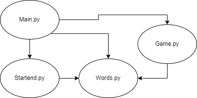
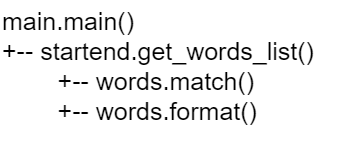
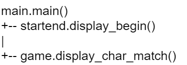
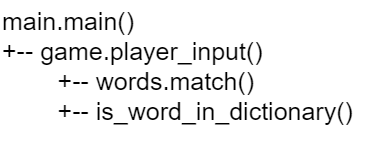

# Document de conception - SUTOM Groupe 2

## 1 Rappel du cahier des charges
### 1.1 Contraintes techniques

Le programme sera écrit en Python, avec le terminal comme interface utilisateur.

### 1.2 Fonctionnalités
* Démarrer une partie
    * Afficher la première lettre du mot à trouver
* Jouer une manche
    * Saisir un mot au clavier
    * Vérifier la saisie du joueur
        * vérifier si la longueur du mot proposé
        * vérifier si la proposition est inclue dans le dictionnaire du jeu
    * Vérifier si les lettres sont incluses dans le mot à deviner
    * Vérifier la position des lettres
    * Afficher le résultat en fonction du choix du joueur et des deux vérifications ci-dessus
* Finir la partie (soit par la victoire du joueur s'il a trouvé le mot ; soit par sa défaite s'il a utilisé son nombre d'essais maximum)

### 1.3 P1 :Prototype P1
Ce prototype contient les fonctionnalités strictement indispensables.
Mise en oeuvre des fonctionnalités d'importance 0.

### 1.4 P2 :Prototype P2
Ce prototype contient toutes les fonctionnalités.
Ajout à P1 des fonctionnalités d'importance 1 et 2.

## 2 Principes des solutions techniques
### 2.1 Langage

Le programme sera codé en Python.

### 2.2 Interface utilisateur
L'interface utilisateur sera faite sur le terminal, qui affichera les instructions et les résultats.
Les mots entrés par l'utilisateur seront récupérés par l'entrée standard

## 3 Analyse

### 3.1 Dépendance entre modules

### 3.2 Analyse descendante : 
#### 3.2.1 Arbre principal : 

#### 3.2.2 Arbre affichage : 

#### 3.2.3 Arbre interaction : 

## 4 Description des fonctions
### 4.1 Programme principal : Main.py
Démarre le programme avec les fonctions de StartEnd.py, initialise une boucle contenant les fonctions de Game.py, termine le programme avec StartEnd.py.

### 4.2 StartEnd.py
Initialise le jeu : vérifie l'existence d'une liste de mots, en choisi un au hasard, efface le terminal et affiche la première lettre du mot à deviner.
Termine le jeu : affiche le résultat (victoire ou défaite), et le mot à deviner.
* **get_words_list**()
    * Vérifie l'existence du fichier list.txt, le lit, formate les caractères à l'aide de words.py, renvoie la liste des mots, formatés
    * Paramètre : aucun
    * Renvoie : liste
* **display_begin**(word_to_find, length_word)
    * Affiche la première lettre du mot avec "_" pour les lettres restantes
    * Paramètre : chaîne de caractères, entier
    * Renvoie : null

### 4.3 Game.py
Fonctions utilisées dans la boucle de jeu : obtient le mot entré par le joueur dans l'entrée standard, le compare lettre par lettre au mot à deviner, affiche les différences.
* **display_char_match**(word_a, word_b)
    * Vérifie la présence et la place des lettres d'un mot, par rapport au 2nd mot utilisé comme référence, renvoie le résultat avec () et/ou []
    * Paramètres : deux chaînes de caractères
    * Renvoie : chaîne de caractères
* **player_input**(length, dictionary)
    * Récupère l'input du joueur, vérifie s'il s'agit d'un mot de la bonne longueur, si il a un format correct et si le mot est présent dans la liste des mots, et renvoie le mot saisi formaté
    * Paramètre : entier, liste
    * Renvoie : chaîne de caractères
* **is_word_in_dictionary**(dictionary, word)
    * Vérifie si le mot entré par l'utilisateur est bien présent dans la liste des mots du fichier texte, renvoie vrai ou faux selon le résultat du test
    * Paramètre : liste, chaîne de caractères
    * Renvoie : booléen

### 4.4 Words.py
Outils de vérification et de formatage des mots, utilisés par les autres fonctions.
* **match**(char)
    * Vérifie si une chaine de caractères ne contient que les caractères acceptés
    * Paramètre : chaîne de caractères
    * Renvoie : booléen
* **format**(word)
    * Transforme une chaine de caractères et la renvoie en majuscules, sans accents
    * Paramètre : chaîne de caractères
    * Renvoie : chaîne de caractères

